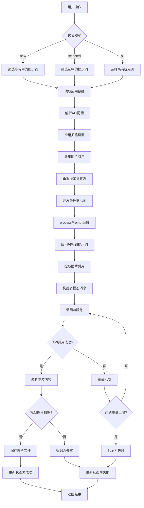
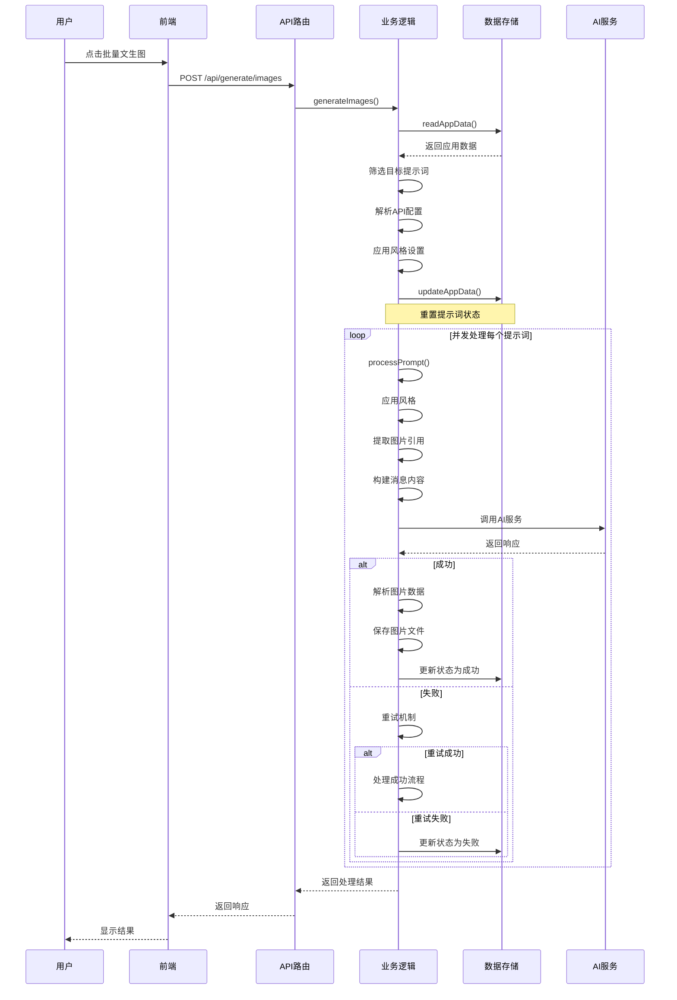
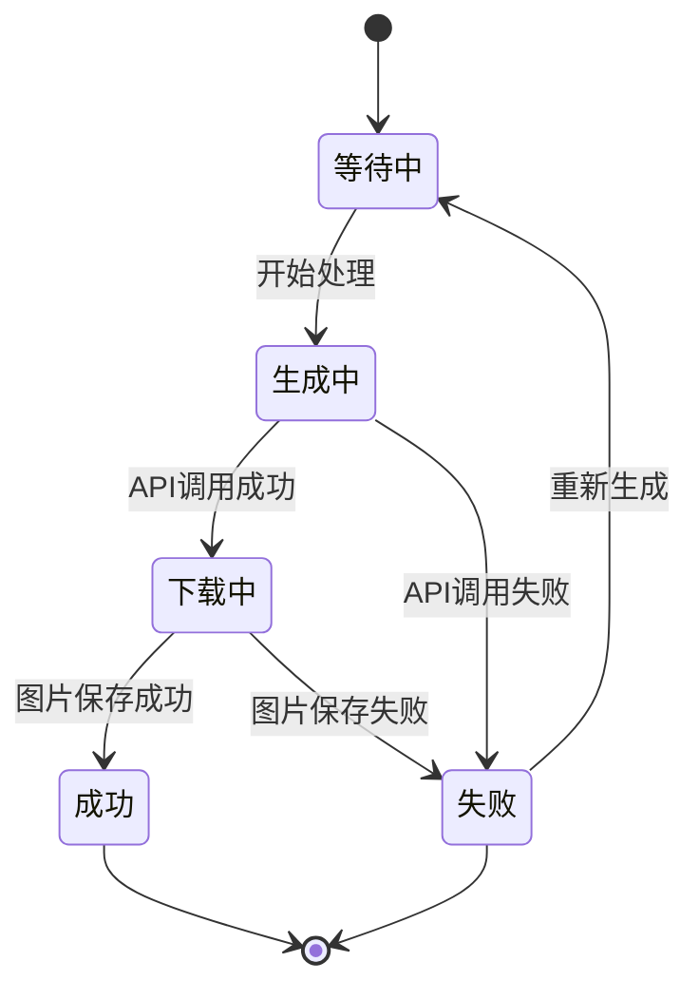
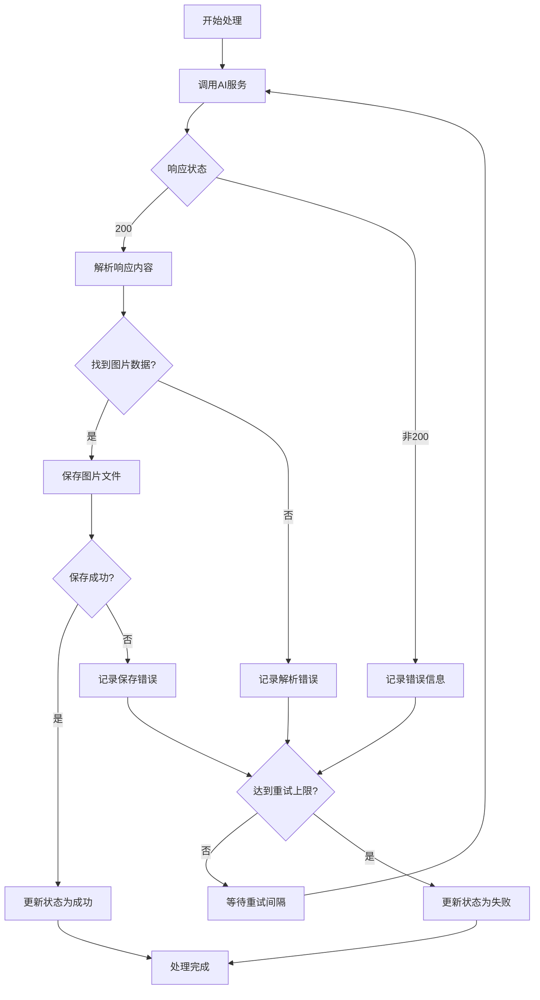
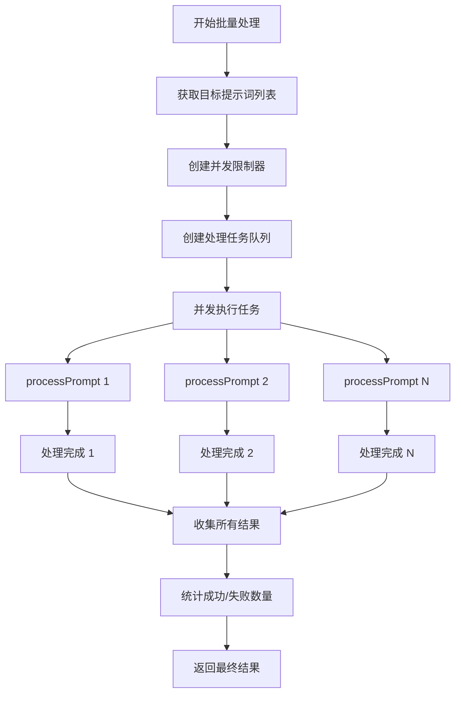
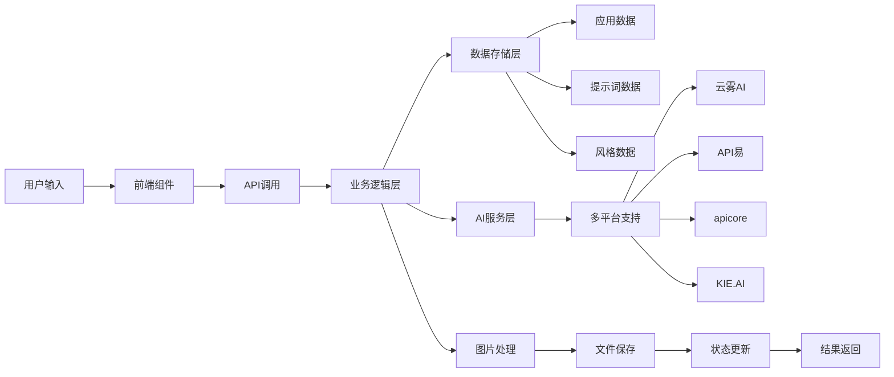
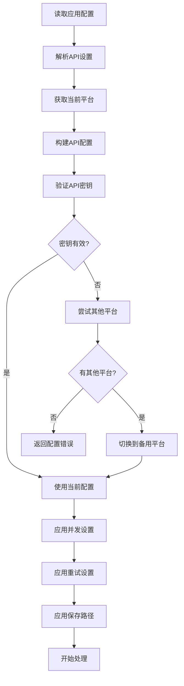

# 批量文生图系统流程图

## 系统架构流程图

## 详细处理流程图

## 状态流转图

## 错误处理流程图

## 并发处理流程图

## 数据流图

## 配置管理流程图

这个流程图展示了批量文生图系统的完整处理流程，包括：

1. **系统架构**: 展示了各个组件之间的关系
2. **详细处理流程**: 展示了从用户操作到最终结果的完整过程
3. **状态流转**: 展示了提示词状态的变化过程
4. **错误处理**: 展示了各种错误情况的处理方式
5. **并发处理**: 展示了如何并发处理多个提示词
6. **数据流**: 展示了数据在系统中的流动
7. **配置管理**: 展示了配置的读取和应用过程
